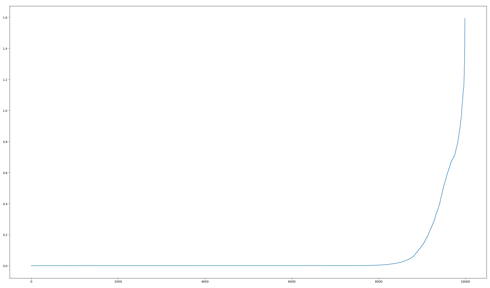

# Some cool experiments with diffusion

With this repo you will be able to train small scale diffusion models based on [Improved Denoising Diffusion Probabilistic Models](https://arxiv.org/abs/2102.09672) and Denoising Diffusion Probabilistic Models
## Example Diffusion Model on MINST dataset with contextual embedding
### generating `0`

### generating `3`


### Bigger scale/color images
Even tho I work most of the time with minst dataset I tried to train in on bigger dataset. But this kind of training requires a bit more time and bigger model
Samole images from `900k` param model (Subset of Imagenet dataset, 64x64px)


### sampling 


## Study of image quality
I performed simple study to check if diffusion model can be used as data-augumantaion technique. But unfortutently images generated by model can spoil data and acually reduce accuracy of model.
Only thing we can do is to remove bad quality images by defining the heuristic that will filter out garbage. 
We can train MINST clasiffier on dataset and then use it to determin uncertain and wrongly classified images
I tried few heuristices
* Entropy of net output
* absolute error
* sum of squeres of entropy and abs error
### Example plot of entropy distribution for generated images

Images can be generated with `generate_dataset.py` script and minst model trained with `experiments/train_minst_clasifier.py`

# How to reproduce?
## Training
You can just install dependencies (`python 3.9`, `tensorflow=2.12.1`) (on `WSL`) and run one of the training scprit with default args
```
~/pyrepos/diffusion  main ✔                                                                         10m  ⍉
› python experiments/train_2.py
```
* `train_1.py` - Will train on minst dataset without embedding
* `train_2.py` - Will train model on minst with embedding
* `train_3.py` - Will train model on subset of ImageNet with embedding

Depending on task, dataset and net size you will need to wait from few epoch few hundred. MINST is pritty easy to train and will take few minutes with modern GPU.

## Generating
Generating scripts can be used to generate images with given model and arguments. check `exp_2_batch.py` to generate images of MINST dataset
```
~/pyrepos/diffusion  main ✔                                                                                                                                                                 9m  
› python exp_2_batch.py --model '/home/lord225/pyrepos/diffusion/retain/model-2-41.weights.h5' --c 5
```
Output:

